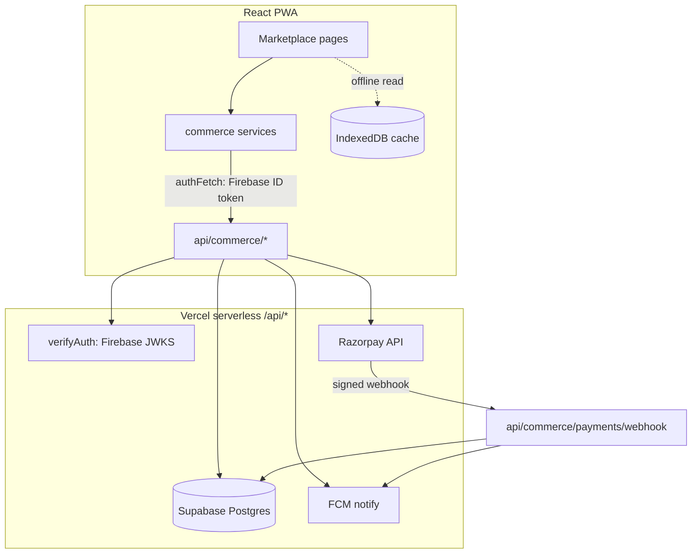

# AgriOS India — Commerce Backend Implementation Spec

**Status:** Draft for build · **Scope:** Marketplace first, then Service-Marketplace & Logistics on the same foundation
**Decisions locked:** Supabase (Postgres) · Razorpay · reuse Firebase Auth · extend the existing Vercel `api/*` layer

> This spec turns the four backend-less modules (Marketplace, Service-Marketplace,
> Logistics, Payments) into a real, server-authoritative, multi-party backend
> **without** disturbing the local-first model used for personal farm data.

---

## 1. Why a backend at all (the one thing to keep in mind)

The rest of AgriOS is **local-first, single-tenant**: each user syncs *their own*
data to *their own* Firestore path, and `firestore.rules` deny cross-user access.
Commerce is the opposite: a listing one user creates must be visible to **all**
buyers, and an order must be actable by **both** buyer and seller. You cannot sell
to yourself offline. So commerce needs **shared, server-authoritative** data — a
different store with a different trust model. We add that store; we do not migrate
the personal-data model onto it.

## 2. Architecture



**Trust boundary = the API layer.** The client is never trusted for
prices, stock, order state, or payment status. Every mutation is authenticated
(Firebase ID token, already verified by `api/_middleware/verifyAuth.js`) and
authorized in code before touching Postgres.

**Two data planes, deliberately separate:**

| Plane | Store | Model | Offline |
|---|---|---|---|
| Personal farm data (existing) | IndexedDB + per-user Firestore | local-first, single-tenant | full |
| Commerce (new) | Supabase Postgres via `/api/*` | server-authoritative, multi-party | read-only cache |

## 3. Auth model (no migration)

Firebase Auth stays the identity provider. The client already attaches the
Firebase ID token via `src/services/firebase/authFetch.js`; the serverless layer
already verifies it via `verifyToken(req)` → `payload.sub` = Firebase uid.

**User mirror.** On the first authenticated commerce call, an
`ensureUser(uid, claims)` middleware upserts a row into `users` keyed by
`firebase_uid` and returns the internal `users.id` (uuid) used as the FK
everywhere else. No separate login, no Supabase Auth.

> **Authorization lives in the API, not in Supabase RLS.** Because identity is
> Firebase (not Supabase Auth), the serverless functions connect with the
> **service-role** key and enforce authz in code (buyer vs seller vs public).
> RLS is added later as defense-in-depth by setting a per-transaction
> `SET LOCAL request.uid = '<uid>'` and writing row policies against it — but the
> API layer is the primary gate from day one. (Do **not** ship the service-role
> key to the client; it bypasses RLS.)

## 4. Data model (Postgres)

Conventions: `uuid` PKs (`gen_random_uuid()`), **money as integer paise** (never
floats), `created_at/updated_at timestamptz default now()`, soft-delete via
`deleted_at`, `updated_at` maintained by a trigger.

```sql
-- identity mirror ---------------------------------------------------------
create table users (
  id            uuid primary key default gen_random_uuid(),
  firebase_uid  text unique not null,
  phone         text,
  name          text,
  is_seller     boolean not null default false,
  kyc_status    text not null default 'none',   -- none|pending|verified|rejected
  created_at    timestamptz not null default now(),
  updated_at    timestamptz not null default now()
);

-- catalog -----------------------------------------------------------------
create table listings (
  id           uuid primary key default gen_random_uuid(),
  seller_id    uuid not null references users(id),
  title        text not null,
  description  text,
  category     text not null,                    -- crop|seed|feed|livestock|equipment|...
  unit         text not null,                    -- kg|quintal|piece|litre
  price_paise  bigint not null check (price_paise >= 0),
  currency     text not null default 'INR',
  qty_available numeric not null default 0 check (qty_available >= 0),
  min_order    numeric not null default 1,
  state        text, district text,
  status       text not null default 'draft',    -- draft|active|paused|sold_out|archived
  created_at   timestamptz not null default now(),
  updated_at   timestamptz not null default now(),
  deleted_at   timestamptz
);
create index on listings (status, category) where deleted_at is null;
create index on listings (seller_id) where deleted_at is null;
-- full-text + fuzzy search
create index on listings using gin (to_tsvector('simple', coalesce(title,'')||' '||coalesce(description,'')));

create table listing_media (
  id         uuid primary key default gen_random_uuid(),
  listing_id uuid not null references listings(id) on delete cascade,
  url        text not null,
  sort       int not null default 0
);

-- orders ------------------------------------------------------------------
create table orders (
  id             uuid primary key default gen_random_uuid(),
  buyer_id       uuid not null references users(id),
  seller_id      uuid not null references users(id),  -- denormalized for seller queries
  status         text not null default 'pending_payment',
    -- pending_payment|paid|confirmed|shipped|delivered|cancelled|refunded
  subtotal_paise bigint not null,
  shipping_paise bigint not null default 0,
  total_paise    bigint not null,
  currency       text not null default 'INR',
  delivery_addr  jsonb,
  created_at     timestamptz not null default now(),
  updated_at     timestamptz not null default now()
);
create index on orders (buyer_id, created_at desc);
create index on orders (seller_id, status);

create table order_items (
  id               uuid primary key default gen_random_uuid(),
  order_id         uuid not null references orders(id) on delete cascade,
  listing_id       uuid not null references listings(id),
  title_snapshot   text not null,                 -- price/title snapshotted at order time
  unit_price_paise bigint not null,
  quantity         numeric not null check (quantity > 0),
  line_total_paise bigint not null
);

-- payments ----------------------------------------------------------------
create table payments (
  id                 uuid primary key default gen_random_uuid(),
  order_id           uuid not null unique references orders(id),
  provider           text not null default 'razorpay',
  provider_order_id  text,                          -- rzp order id
  provider_payment_id text,
  amount_paise       bigint not null,
  status             text not null default 'created', -- created|authorized|captured|failed|refunded
  raw                jsonb,
  created_at         timestamptz not null default now(),
  updated_at         timestamptz not null default now()
);

-- webhook idempotency -----------------------------------------------------
create table webhook_events (
  id           uuid primary key default gen_random_uuid(),
  provider     text not null,
  event_id     text not null,
  payload      jsonb not null,
  processed_at timestamptz,
  created_at   timestamptz not null default now(),
  unique (provider, event_id)
);

-- reviews -----------------------------------------------------------------
create table reviews (
  id           uuid primary key default gen_random_uuid(),
  order_id     uuid not null references orders(id),
  reviewer_id  uuid not null references users(id),
  subject_type text not null,                       -- listing|seller
  subject_id   uuid not null,
  rating       int not null check (rating between 1 and 5),
  comment      text,
  created_at   timestamptz not null default now(),
  unique (order_id, reviewer_id, subject_type)
);
```

**Notes**
- Money is integer **paise** end to end — the app's `₹` formatting divides by 100 at the edge. This also closes the rounding/float concerns from the QA audit.
- `order_items` snapshots title + unit price so later listing edits never rewrite order history.
- Soft-delete (`deleted_at`) mirrors the Phase-1 local convention, so the two planes behave consistently.

## 5. API surface (`api/commerce/*`)

Same shape as existing functions: default-export `handler(req, res)`, `verifyToken` first, JSON in/out, integer paise. All require a valid token unless noted.

| Method & path | Who | Purpose |
|---|---|---|
| `GET  /api/commerce/listings?q&category&state&price_max&cursor` | any authed | Browse/search active listings (paginated) |
| `POST /api/commerce/listings` | seller | Create listing (auto-sets `seller_id`, status=`draft`) |
| `GET  /api/commerce/listings/[id]` | any authed | Listing detail + media |
| `PATCH /api/commerce/listings/[id]` | owner | Edit / publish (`status=active`) / pause |
| `DELETE /api/commerce/listings/[id]` | owner | Soft-delete |
| `POST /api/commerce/orders` | buyer | Validate cart → create order + Razorpay order (see §6) |
| `GET  /api/commerce/orders?role=buyer|seller` | buyer/seller | List my orders |
| `GET  /api/commerce/orders/[id]` | buyer or seller of it | Order detail |
| `PATCH /api/commerce/orders/[id]` | authorized party | Status transition (seller: confirm→ship; buyer: cancel pre-ship) |
| `POST /api/commerce/payments/webhook` | Razorpay (no user token; **signature-verified**) | Payment source of truth (see §6) |
| `POST /api/commerce/reviews` | buyer of a delivered order | Rate listing/seller |

Cart stays **client-side** (IndexedDB) so browsing works offline; it is re-validated server-side at `POST /orders`. Pagination is cursor-based (`created_at,id`).

## 6. Payment flow (Razorpay) — the critical path

```mermaid
sequenceDiagram
  participant C as Client
  participant A as api/commerce/orders
  participant DB as Postgres
  participant R as Razorpay
  participant W as api/.../payments/webhook

  C->>A: POST /orders {items, address}
  A->>DB: BEGIN; validate listings/prices; lock rows; reserve stock
  A->>DB: insert orders(pending_payment)+order_items+payments(created)
  A->>R: create Razorpay order (amount_paise)
  A->>DB: payments.provider_order_id = rzp.id; COMMIT
  A-->>C: {orderId, razorpayOrderId, amount, keyId}
  C->>R: open Checkout, user pays
  R-->>W: webhook payment.captured (X-Razorpay-Signature)
  W->>W: verify HMAC(webhook_secret); idempotent via event_id
  W->>DB: payments.captured; orders.paid→confirmed; release nothing
  W->>C: (FCM) buyer + seller notified
```

**Rules that make this safe**
1. **Fulfillment is driven by the webhook**, never the client success callback. The callback only updates the UI; the webhook is the source of truth.
2. **Signature verification** on the webhook: `HMAC_SHA256(body, RAZORPAY_WEBHOOK_SECRET) === X-Razorpay-Signature`. Reject otherwise.
3. **Idempotency**: insert into `webhook_events(provider,event_id)`; if it already exists, ack and no-op.
4. **Stock atomicity** (prevents overselling under concurrency), inside the order transaction:
   ```sql
   update listings set qty_available = qty_available - $qty
   where id = $id and deleted_at is null and qty_available >= $qty
   returning qty_available;   -- 0 rows ⇒ insufficient stock ⇒ abort order
   ```
5. **Reservation timeout**: orders stuck in `pending_payment` past N minutes are cancelled by a sweep (Vercel Cron) and their reserved stock returned.
6. **Marketplace settlements**: use **Razorpay Route** to split captured funds to the seller minus platform commission (transfers), so money never pools in one wallet. (Requires seller KYC/linked account — see §12 open items.)

## 7. Authorization matrix (enforced in the API)

| Action | Allowed principal | Check |
|---|---|---|
| Edit/delete listing | listing owner | `listing.seller_id == me` |
| Place order | any buyer (not on own listing) | `listing.seller_id != me` |
| View order | buyer or seller of that order | `me in (order.buyer_id, order.seller_id)` |
| Confirm/ship order | seller of order | `order.seller_id == me` + valid transition |
| Cancel order | buyer (pre-ship) or seller | state-machine guard |
| Mark paid | **nobody** — webhook only | no user path sets `paid` |
| Review | buyer of a `delivered` order | `order.buyer_id == me && status=='delivered'` |

Order status is a **state machine**; illegal transitions (e.g. `delivered→pending`) are rejected server-side.

## 8. Client rewiring (keep the pages, swap the data source)

The existing pages (`pages/marketplace/*`) and service interfaces
(`productService`, `cartService`, `mpOrderService`) stay; only the **implementation**
changes from `marketDb` (IndexedDB) to `authFetch('/api/commerce/*')`:

- **Listings**: fetched from the API, cached in IndexedDB for offline browsing.
- **Cart**: remains local (offline-friendly); validated at checkout.
- **Orders/payments**: online-only (payment requires connectivity) — show a clear "connect to complete purchase" state offline rather than queueing.
- **My orders**: fetched from the API; last response cached for offline viewing.

Because the service method signatures are preserved, page components need minimal change. The local `marketDb` becomes a read cache, not the system of record.

## 9. Cross-cutting

- **Rate limiting**: move commerce write endpoints off the in-memory per-instance limiter (QA finding M3) to **Upstash Redis** (shared across the Vercel fleet).
- **Search**: Postgres FTS (`to_tsvector`) + `pg_trgm` for fuzzy matches; graduate to Meilisearch/Typesense when the catalog grows.
- **Notifications**: reuse FCM (`fcmService`) — order placed (seller), payment confirmed (both), status changes.
- **Observability**: `webhook_events` is the payment audit log; add structured logs + a Razorpay reconciliation cron.
- **Media**: reuse **Firebase Storage** (already wired, and `storage.rules` now exist) under `users/{uid}/listings/…` — no second storage system.

## 10. Environment / config

Server (Vercel env, **never** `VITE_`):
```
SUPABASE_URL, SUPABASE_SERVICE_ROLE_KEY
RAZORPAY_KEY_ID, RAZORPAY_KEY_SECRET, RAZORPAY_WEBHOOK_SECRET
UPSTASH_REDIS_REST_URL, UPSTASH_REDIS_REST_TOKEN
```
Client (safe to expose):
```
VITE_RAZORPAY_KEY_ID          # publishable key id for Checkout
```
Reused as-is: `FB_PROJECT_ID` (token verification), FCM config.

## 11. Testing

- **Unit**: pricing (paise math), authorization checks, order state machine, webhook signature + idempotency.
- **Integration**: order→Razorpay(test mode)→mocked webhook→fulfillment; concurrency test proving no oversell (parallel orders on last unit).
- **E2E** (later): Playwright happy-path buy flow against a preview deployment.
- Keep the existing Vitest suite green; add a separate integration project that talks to a disposable Postgres (Supabase branch or `pg` in CI).

## 12. Rollout phases (with acceptance criteria)

| Phase | Deliverable | Acceptance |
|---|---|---|
| **B0 Foundation** | Supabase project, schema + migrations in repo, `ensureUser` middleware, authed `api/commerce` skeleton, migrations in CI | An authed request creates/loads its `users` row |
| **B1 Listings** | Seller CRUD + publish, buyer browse/search, media upload | Seller posts a listing; buyer finds it via search/filter |
| **B2 Orders + Payments** | Cart→order→Razorpay→webhook→fulfill; atomic stock | Test-mode payment moves order to `paid`; oversell is impossible under concurrent orders |
| **B3 Post-order** | Status transitions, FCM notifications, reviews | Buyer+seller see live status; review allowed only after `delivered` |
| **B4 Hardening** | Razorpay **Route** payouts, refunds/cancellations, Upstash rate limit, reservation-timeout cron, reconciliation | Funds settle to seller minus commission; stuck orders auto-release stock |

**Then, on the same foundation:**
- **Service-Marketplace** reuses `users` (as providers), adds `service_offerings`, `availability`, `bookings` (request→accept→complete→pay), reviews.
- **Logistics** links `shipments` to `orders`, adds carrier/driver assignment, `shipment_events` (tracking), proof-of-delivery.

## 13. Open items needing a decision before B4

1. **Seller onboarding / KYC & payouts** — Razorpay Route needs sellers to have linked accounts + KYC. When is a seller allowed to list vs. to receive money? (Suggest: list after basic profile; payout only after KYC.)
2. **Platform commission** — flat %, per-category, or none initially? Drives the Route transfer split.
3. **Delivery model** — self-pickup / seller-arranged / platform logistics (the Logistics module)? Affects `shipping_paise` and order flow.
4. **Refund/cancellation policy** — window, who can cancel when, restocking.
5. **Media storage** — confirmed reuse of Firebase Storage (recommended) vs. Supabase Storage.

---

*Companion to `ARCHITECTURE.md` (personal-data plane) and the QA audit's H6 finding.
Nothing here changes the local-first behavior of the rest of the app.*
